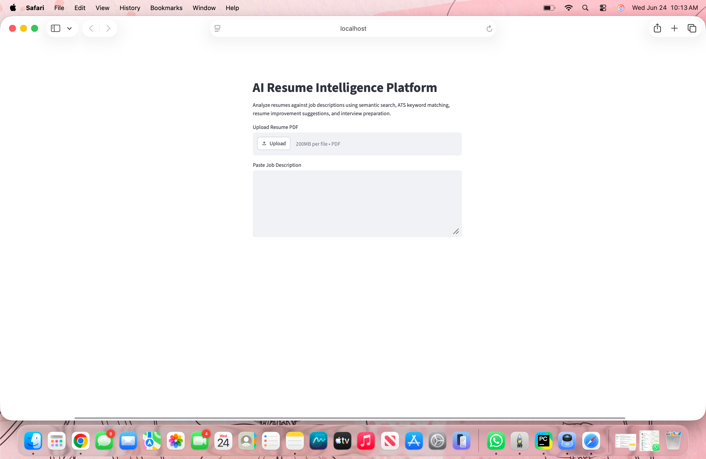
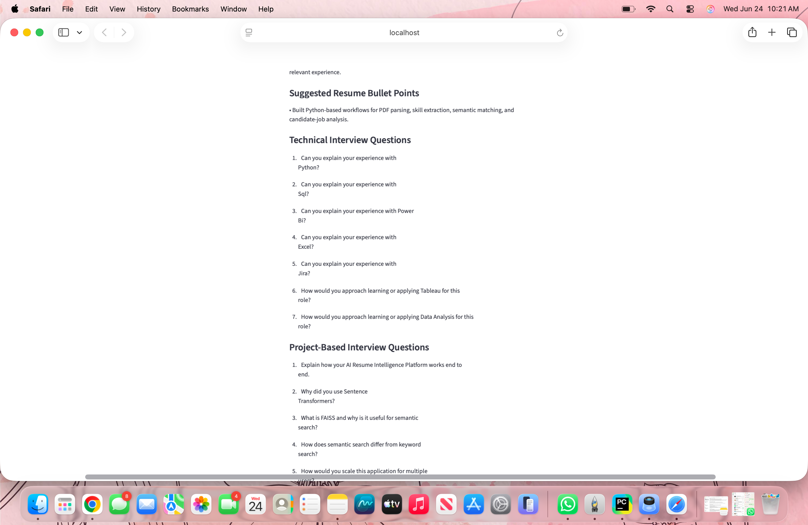

# AI Resume Intelligence Platform

## Overview
AI-powered resume analysis platform using Python, Streamlit, Sentence Transformers, and semantic search.

## Features
- Resume PDF upload
- Job description analysis
- Semantic match score
- ATS keyword score
- Matching and missing skills
- Resume improvement suggestions
- Suggested resume bullet points
- Interview question generation

## Tech Stack
- Python
- Streamlit
- PyPDF
- Sentence Transformers
- Scikit-learn
- FAISS
- GitHub

## How It Works
1. Upload resume PDF
2. Paste job description
3. Extract resume text
4. Generate embeddings
5. Compare resume with job description
6. Display match scores and recommendations

## Run Locally

pip install -r requirements.txt

streamlit run main.py

## Screenshots

### Homepage

### Analysis Dashboard

### Match Score & ATS Analysis

### Resume Improvement Suggestions

### Interview Preparation Dashboard
